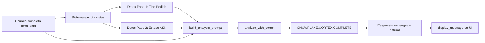

# 🤖 Análisis con IA - Documentación Técnica

Sistema de análisis inteligente de incidencias usando **Snowflake Cortex COMPLETE**.

---

## 📋 Índice

1. [Resumen](#resumen)
2. [Flujo de Análisis](#flujo-de-análisis)
3. [Construcción del Prompt](#construcción-del-prompt)
4. [Modelos Disponibles](#modelos-disponibles)
5. [Configuración](#configuración)
6. [Personalización](#personalización)
7. [Ejemplos](#ejemplos)
8. [Troubleshooting](#troubleshooting)

---

## Resumen

El módulo `core/ai_analysis.py` implementa análisis inteligente de incidencias usando **Snowflake Cortex COMPLETE**. 

**¿Qué hace?**
- Recibe datos de incidencia + resultados de vistas SQL
- Construye un prompt contextual con toda la información
- Llama a Snowflake Cortex para análisis con LLM
- Retorna interpretación en lenguaje natural

**Ventajas:**
✅ **Interpretación automática** de datos técnicos  
✅ **Recomendaciones concretas** para resolver incidencias  
✅ **Lenguaje natural** accesible para usuarios de negocio  
✅ **Contexto completo** incluyendo datos de formulario y vistas  
✅ **Múltiples modelos** disponibles (Mistral, LLaMA, etc.)

---

## Flujo de Análisis



### Paso a Paso

1. **Captura de Datos** (`incidencia.py`)
   - Usuario completa formulario
   - Datos se guardan en `st.session_state.incidencia_data`

2. **Ejecución de Vistas** (`queries.py`)
   ```python
   results = get_all_analyst_results(incidencia_data)
   # results = {
   #   "diagnostico_paso1": {"data": DataFrame, "error": None},
   #   "diagnostico_paso2": {"data": DataFrame, "error": None}
   # }
   ```

3. **Construcción de Prompt** (`ai_analysis.py`)
   ```python
   prompt = build_analysis_prompt(incidencia_data, results)
   # → Texto con contexto completo (1000-3000 chars)
   ```

4. **Análisis con IA** (`ai_analysis.py`)
   ```python
   analysis, error = analyze_with_cortex(prompt, model="mistral-large")
   # → Respuesta del LLM en texto plano
   ```

5. **Presentación** (`ui.py`)
   - Primero: Análisis de IA en markdown
   - Luego: Tablas de datos con botones CSV

---

## Construcción del Prompt

### Estructura del Prompt

```
[CONTEXTO DE SISTEMA]
Eres un asistente experto en logística y gestión de pedidos...

[DATOS DE LA INCIDENCIA]
- UNECO: 001
- Pedido Host: 123456
- Almacén: ALM01
- Referencia: REF789
- FEO: 2024-01-15
- FIS: 2024-01-20
- Descripción: Diferencias en cantidades recibidas

[DIAGNÓSTICO PASO 1 - TIPO DE PEDIDO]
Se encontraron 1 registro(s):
CO_PEDIDO_HOST  TIPO_PEDIDO    ...
123456          AGRUPADO       ...

[DIAGNÓSTICO PASO 2 - ESTADO ASN]
Se encontraron 3 registro(s):
CO_PEDIDO  CO_ESTADO  DIFERENCIAS_REVISION  ...
123456     RECIBIDO   -5                    ...

[INSTRUCCIONES AL LLM]
TU TAREA:
1. Analiza la información de la incidencia y los datos de diagnóstico
2. Identifica el TIPO DE PEDIDO y explica qué significa
3. Analiza el ESTADO del ASN y las DIFERENCIAS DE REVISIÓN
4. Identifica el PROBLEMA PRINCIPAL
5. Proporciona RECOMENDACIONES concretas
6. Menciona ALERTAS o puntos críticos

FORMATO DE RESPUESTA:
- Lenguaje claro en español
- Usa emojis (📊 📦 ⚠️ ✅ ❌)
- Estructura con títulos claros
- Si hay diferencias, resáltalas
```

### Función: `build_analysis_prompt()`

```python
def build_analysis_prompt(incidencia_data: Dict, results: Dict) -> str:
    """
    Construye prompt con contexto completo.
    
    Args:
        incidencia_data: {
            "uneco": "001",
            "pedido_host": "123456",
            "almacen": "ALM01",
            "referencia": "REF789",
            "descripcion": "Texto libre",
            ...
        }
        results: {
            "diagnostico_paso1": {
                "data": DataFrame | None,
                "error": str | None,
                "vista": "V_DIAGNOSTICO_PASO1_TIPO_PEDIDO"
            },
            "diagnostico_paso2": {...}
        }
    
    Returns:
        Prompt de ~1000-3000 caracteres
    """
```

**Personalización:**
- Modificar instrucciones en línea ~55-75
- Agregar campos adicionales de incidencia_data
- Cambiar formato de respuesta esperado
- Incluir contexto de vistas adicionales (Paso 3, 4, etc.)

---

## Modelos Disponibles

### Modelos Cortex Soportados

| Modelo | Tamaño | Velocidad | Calidad | Uso Recomendado |
|--------|--------|-----------|---------|-----------------|
| `mistral-large` | Grande | Media | ⭐⭐⭐⭐⭐ | **Análisis complejo, predeterminado** |
| `mixtral-8x7b` | Grande | Media | ⭐⭐⭐⭐ | Balance速度/calidad |
| `snowflake-arctic` | Muy Grande | Lenta | ⭐⭐⭐⭐⭐ | Análisis profundo |
| `llama3-70b` | Grande | Media | ⭐⭐⭐⭐⭐ | Análisis detallado |
| `llama3-8b` | Pequeño | Rápida | ⭐⭐⭐ | Respuestas rápidas |
| `mistral-7b` | Pequeño | Rápida | ⭐⭐⭐ | Análisis básico |
| `gemma-7b` | Pequeño | Rápida | ⭐⭐⭐ | Resúmenes simples |

### Selección de Modelo

**Desde la UI:**
- Sidebar → Configuración → "Modelo Cortex"
- Se guarda en `st.session_state.cortex_model`

**Programáticamente:**
```python
from core.ai_analysis import get_ai_analysis

ai_response = get_ai_analysis(
    incidencia_data=data,
    results=vista_results,
    model="llama3-70b"  # Especificar modelo
)
```

### Función: `get_available_cortex_models()`

```python
def get_available_cortex_models() -> List[str]:
    """Retorna lista de modelos disponibles en Snowflake Cortex."""
    return [
        "mistral-large",
        "mixtral-8x7b",
        "snowflake-arctic",
        "llama3-70b",
        "llama3-8b",
        "mistral-7b",
        "gemma-7b"
    ]
```

---

## Configuración

### Requisitos Previos

1. **Rol Snowflake con permisos:**
   ```sql
   GRANT ROLE SNOWFLAKE.CORTEX_USER TO ROLE MI_ROL;
   -- O más específico:
   GRANT USAGE ON FUNCTION SNOWFLAKE.CORTEX.COMPLETE TO ROLE MI_ROL;
   ```

2. **Modelos habilitados en la cuenta:**
   - Los modelos varían según región
   - Verificar disponibilidad en Snowflake docs

### Variables de Sesión

```python
# En st.session_state:
- "cortex_model": str          # Modelo seleccionado
- "incidencia_data": Dict       # Datos del formulario
- "snowpark_session": Session   # Conexión Snowflake activa
```

### Timeouts y Límites

```python
# En analyze_with_cortex():
timeout = 60  # segundos (ajustable)

# Límites de prompt:
max_prompt_length = ~10,000 caracteres (aproximado)
```

---

## Personalización

### 1. Modificar Prompt

Editar `build_analysis_prompt()` en `core/ai_analysis.py`:

```python
# Línea ~55 - Agregar más contexto
context += f"""
**DATOS ADICIONALES:**
- Campo personalizado: {incidencia_data.get('mi_campo')}
- ERP Info: {incidencia_data.get('erp_data')}
"""

# Línea ~80 - Cambiar instrucciones
context += """
**TU TAREA (PERSONALIZADA):**
1. Analiza primero el campo X
2. Compara con histórico
3. Genera reporte en formato TABLA
...
"""
```

### 2. Agregar Métricas Personalizadas

Función `extract_key_metrics()`:

```python
def extract_key_metrics(df: pd.DataFrame, vista_type: str) -> Dict:
    """Extrae KPIs específicos del negocio."""
    
    metrics = {}
    
    if vista_type == "paso1":
        # Agregar lógica personalizada
        if "MI_COLUMNA_CUSTOM" in df.columns:
            metrics["custom_kpi"] = df["MI_COLUMNA_CUSTOM"].sum()
    
    return metrics
```

### 3. Formateo de Respuesta

En `format_analyst_response()` de `analyst.py`:

```python
# Línea ~110 - Personalizar presentación
if ai_analysis:
    content.append({
        "type": "text",
        "text": "## 🤖 DIAGNÓSTICO INTELIGENTE\n\n" + 
                ai_analysis["analysis"] +
                f"\n\n*Modelo: {ai_analysis['model']}*"
    })
```

### 4. Selector de Modelo Dinámico

En `auth.py`, línea ~90:

```python
# Cargar modelos desde Snowflake en lugar de hardcode
available_models = fetch_available_models_from_snowflake()
st.selectbox("Modelo Cortex:", available_models, ...)
```

---

## Ejemplos

### Ejemplo 1: Análisis Básico

```python
from core.ai_analysis import get_ai_analysis
from core.queries import get_all_analyst_results

# Datos de incidencia
incidencia = {
    "uneco": "001",
    "pedido_host": "PED123",
    "almacen": "ALM01",
    "descripcion": "Pedido no llegó completo"
}

# Ejecutar vistas
results = get_all_analyst_results(incidencia)

# Analizar con IA
analysis = get_ai_analysis(incidencia, results, model="mistral-large")

if analysis["error"]:
    print(f"❌ Error: {analysis['error']}")
else:
    print(analysis["analysis"])
```

### Ejemplo 2: Comparar Modelos

```python
models = ["mistral-large", "llama3-70b", "mixtral-8x7b"]

for model in models:
    print(f"\n=== Modelo: {model} ===")
    analysis = get_ai_analysis(incidencia, results, model=model)
    print(analysis["analysis"][:200])  # Primeras 200 chars
```

### Ejemplo 3: Prompt Personalizado

```python
from core.ai_analysis import build_analysis_prompt, analyze_with_cortex

# Construir prompt base
base_prompt = build_analysis_prompt(incidencia, results)

# Agregar contexto adicional
custom_prompt = base_prompt + """

CONTEXTO ADICIONAL:
- Cliente VIP: Sí
- Histórico de incidencias: 3 en último mes
- Prioridad: ALTA

Genera un análisis considerando que es un cliente prioritario.
"""

# Analizar
response, error = analyze_with_cortex(custom_prompt, model="mistral-large")
print(response)
```

---

## Troubleshooting

### Error: "Modelo no existe"

```
Error: The model 'mistral-large' does not exist
```

**Causa:** Modelo no disponible en tu región/cuenta.

**Solución:**
1. Verificar modelos disponibles:
   ```sql
   SHOW FUNCTIONS LIKE 'CORTEX%';
   ```
2. Cambiar modelo en sidebar o código:
   ```python
   model = "mixtral-8x7b"  # Modelo alternativo
   ```

### Error: "Insufficient privileges"

```
Error: Insufficient privileges to operate on function CORTEX.COMPLETE
```

**Causa:** Usuario sin permisos Cortex.

**Solución:**
```sql
GRANT ROLE SNOWFLAKE.CORTEX_USER TO ROLE MI_ROL;
-- O específicamente:
GRANT USAGE ON FUNCTION SNOWFLAKE.CORTEX.COMPLETE TO ROLE MI_ROL;
```

### Error: "No hay sesión activa"

```
Error: No hay sesión activa de Snowflake
```

**Causa:** Usuario no está logueado.

**Solución:**
- Verificar login en sidebar
- Reiniciar app si sesión expiró

### Respuestas Incompletas o Incorrectas

**Problema:** La IA no analiza correctamente los datos.

**Soluciones:**
1. **Revisar prompt:** Imprimir `build_analysis_prompt()` y verificar contexto
   ```python
   prompt = build_analysis_prompt(data, results)
   print(prompt)  # Ver qué info recibe la IA
   ```

2. **Cambiar modelo:** Probar modelos más grandes
   ```python
   model = "llama3-70b"  # En lugar de mistral-7b
   ```

3. **Agregar más contexto:** Modificar instrucciones del prompt
   ```python
   # En build_analysis_prompt(), línea ~80
   context += """
   IMPORTANTE: Analiza específicamente las diferencias de revisión.
   Si hay diferencias negativas, indica faltantes.
   """
   ```

4. **Verificar datos de entrada:** Asegurar que vistas retornan datos
   ```python
   if results["diagnostico_paso1"]["data"] is None:
       print("⚠️ Sin datos en Paso 1")
   ```

### Timeout en Análisis

**Problema:** La llamada a Cortex tarda demasiado.

**Solución:**
```python
# En analyze_with_cortex(), timeout configurable (actualmente no implementado)
# Usar modelos más pequeños para respuestas rápidas:
model = "llama3-8b"  # Más rápido que mistral-large
```

### Debug del Prompt

Habilitar impresión del prompt:

```python
# En ai_analysis.py, línea ~85
print(f"\n🤖 Llamando a Cortex modelo: {model}")
print(f"Longitud del prompt: {len(prompt)} caracteres")
print("-" * 50)
print(prompt)  # Imprimir prompt completo
print("-" * 50)
```

---

## Próximos Pasos

### Mejoras Futuras

1. **Cache de Respuestas:**
   - Guardar análisis previos para incidencias similares
   - Evitar llamadas repetidas a Cortex

2. **Fine-tuning del Prompt:**
   - Incluir ejemplos de respuestas ideales
   - Few-shot learning con casos históricos

3. **Métricas de Calidad:**
   - Feedback del usuario (👍👎)
   - Ajustar prompt según feedback

4. **Análisis Multi-paso:**
   - Usar respuesta del LLM para decidir qué vista ejecutar siguiente
   - Árbol de decisión dinámico guiado por IA

5. **Integración con RAG:**
   - Buscar documentación/políticas con Cortex Search
   - Incluir contexto de manuales en el prompt

---

## Referencias

- [Snowflake Cortex Documentation](https://docs.snowflake.com/en/user-guide/snowflake-cortex)
- [Cortex COMPLETE Function](https://docs.snowflake.com/en/sql-reference/functions/complete-snowflake-cortex)
- Código fuente: `core/ai_analysis.py`
- Configuración: `core/auth.py` (selector de modelo)
- Integración: `core/analyst.py` (orquestación)

---

**Última actualización:** 2024
**Autor:** Sistema de Resolución de Incidencias - ECI
