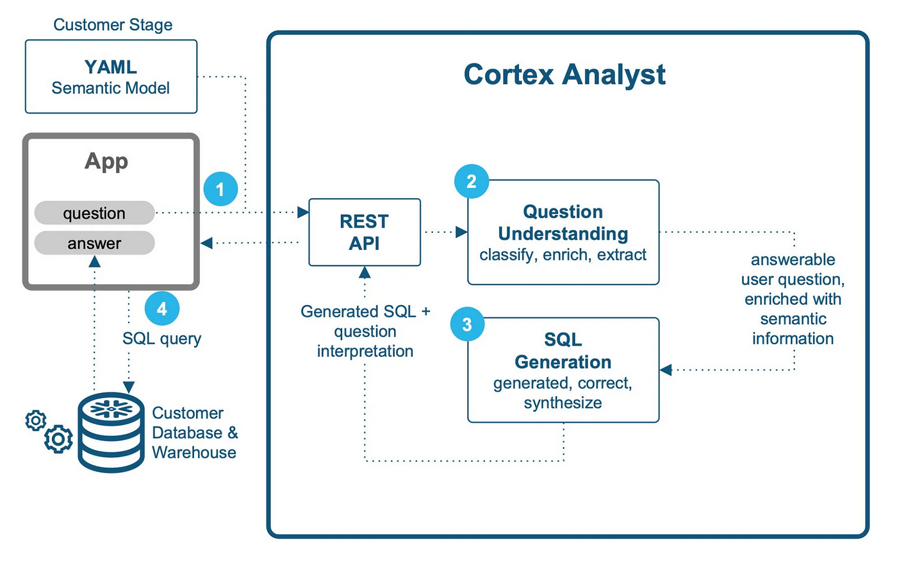
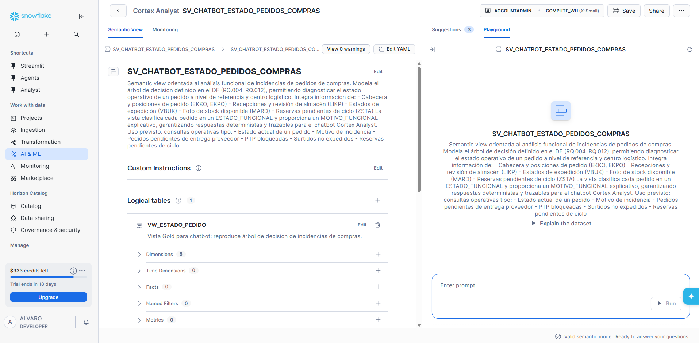

# 🚀 Snowflake Cortex Analyst & Semantic Views Explorer

Esta aplicación de **Streamlit** actúa como una interfaz inteligente y segura para interactuar con **Snowflake Cortex Analyst**. Permite a los usuarios de negocio obtener respuestas precisas de sus datos utilizando lenguaje natural, aprovechando la potencia de las **Semantic Views**.

---

## 🧠 1. ¿Qué es Cortex Analyst?

Cortex Analyst es un servicio totalmente gestionado de Snowflake diseñado para la **Analítica Self-Serve**. Proporciona una experiencia de analítica conversacional sobre datos estructurados con una precisión de grado empresarial.

### Beneficios Clave:
* **Analítica Self-Serve:** Permite a usuarios de negocio obtener respuestas mediante lenguaje natural sin conocimientos técnicos de SQL.
* **Text-to-SQL de Alta Precisión:** Supera a las soluciones "hazlo tú mismo" (DIY) gracias a su motor *agentic* optimizado que comprende profundamente el contexto del dato.
* **Integración Flexible:** Disponible vía REST API, facilitando su integración en Streamlit, Slack, Teams o cualquier aplicación personalizada.

<div align="center">
      
    <br>
  <em>Flujo de comunicación entre la App de Streamlit y Snowflake Cortex Analyst.</em>
</div>

### Seguridad y Gobernanza (Privacy-First)
La IA de Cortex opera bajo los estándares de seguridad más estrictos de Snowflake:
* **Aislamiento de Datos:** Snowflake **no entrena** sus modelos con datos del cliente.
* **Inferencia Local:** Los datos y prompts nunca salen del perímetro de gobernanza de Snowflake.
* **RBAC Nativo:** Integración total con el control de acceso basado en roles. Si el usuario no tiene permiso `SELECT` sobre la tabla, la IA no puede consultar los datos.
* **Transparencia:** Para generar el SQL, solo utiliza los metadatos definidos en el modelo semántico.

---

## 🏗️ 2. El Modelo Semántico (Semantic Views)

El éxito de Cortex Analyst reside en el **Modelo Semántico**. Es el componente que traduce el lenguaje humano a la estructura técnica de la base de datos. Se puede configurar mediante archivos YAML o **Semantic Views**.

 <div align="center">
    
    <br>
  <em>Ejemplo de configuración de Semantic View.</em>
</div>


### Componentes del Modelo:
* **Tablas Lógicas:** Representan entidades comerciales (Clientes, Pedidos, Productos). Incluyen descripciones detalladas y `sample_values`.
* **Dimensiones y Hechos:** Clasificación de datos categóricos (país, categoría) frente a datos cuantitativos a nivel de fila (montos, cantidades).
* **Métricas y Filtros:** Expresiones precalculadas (`expr`) para KPIs (ej: Ingresos totales = `SUM(price * qty)`). Aseguran que toda la empresa use la misma fórmula.
* **Relaciones:** Define explícitamente todos los **Joins**. Cortex Analyst **no unirá tablas** si no están declaradas explícitamente en el modelo.

### Mejores Prácticas:
* **Descripciones > Sinónimos:** Los modelos actuales deducen sinónimos; lo vital es una descripción de negocio clara y detallada.
* **Integración con Cortex Search:** Se puede vincular a columnas de alta cardinalidad para permitir búsquedas difusas (ej: encontrar "Gúgel" como "Google").

---

## ⚡ 3. Consultas Verificadas (Verified Queries)

Es la herramienta más potente para optimizar la precisión y el rendimiento del sistema.

* **¿Qué son?:** Pares de "Pregunta de usuario" + "SQL verificado" (se recomiendan de 10 a 20 ejemplos).
* **Beneficios:**
    * **Precisión:** Guían a la IA en lógicas de negocio complejas (como árboles de decisión).
    * **Velocidad:** Reducen la latencia al evitar llamadas innecesarias al LLM.
    * **Onboarding:** Pueden aparecer como sugerencias iniciales (`use_as_onboarding_question = true`).

---

## ⚙️ 4. Configuración en Snowflake

Para habilitar el servicio en esta aplicación, es necesario asignar los siguientes roles y privilegios:

1.  **Roles de Cortex:**
    * `SNOWFLAKE.CORTEX_USER`: Acceso general a funciones de IA.
    * `SNOWFLAKE.CORTEX_ANALYST_USER`: Acceso específico solo para Cortex Analyst (más seguro).

2.  **Privilegios de Acceso:**
    ```sql
    -- El rol de la App debe tener acceso a los metadatos y datos
    GRANT USAGE ON DATABASE MI_DB TO ROLE MI_ROL;
    GRANT USAGE ON SCHEMA MI_DB.MI_ESQUEMA TO ROLE MI_ROL;
    GRANT SELECT ON ALL SEMANTIC VIEWS IN SCHEMA MI_DB.MI_ESQUEMA TO ROLE MI_ROL;
    GRANT USAGE ON WAREHOUSE MI_WH TO ROLE MI_ROL;
    ```

---

## 💻 5. Instalación Local (VS Code)

1.  **Entorno Virtual:**
    ```bash
    python -m venv venv
    source venv/Scripts/activate
    ```

2.  **Dependencias:**
    ```bash
    pip install -r requirements.txt
    ```

3.  **Secrets (`.streamlit/secrets.toml`):**
    ```toml
    [snowflake]
    account = "tu_id_cuenta.region"
    warehouse = "TU_WH"
    # El usuario y password se solicitan dinámicamente en la App
    ```

4.  **Ejecución:**
    ```bash
    streamlit run cortex_analyst_v2.py
    ```

---

## 🔄 6. Conversación Multi-turno (Contexto Iterativo)

La aplicación soporta conversaciones multi-turno, lo que permite al usuario profundizar en los datos. Por ejemplo:
1. *"¿Cuáles fueron las ventas del año pasado?"*
2. *"¿Y de esas, cuáles corresponden a España?"* (La IA recuerda el contexto anterior).

---

> **Nota:** Este proyecto está diseñado bajo el paradigma **Privacy-First**. La seguridad de los datos es la prioridad y se apoya totalmente en el RBAC nativo de Snowflake.